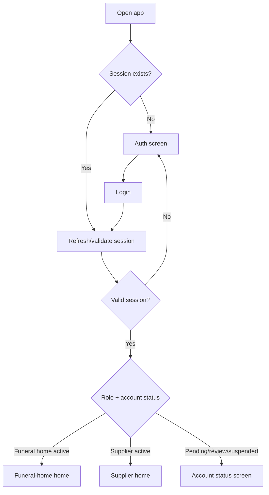
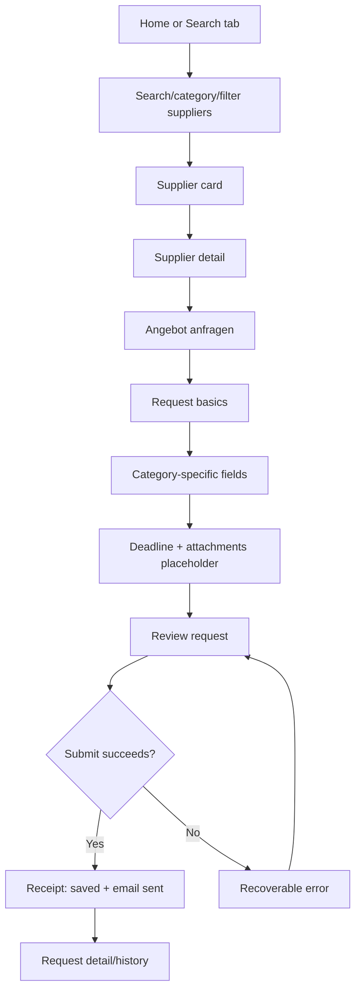
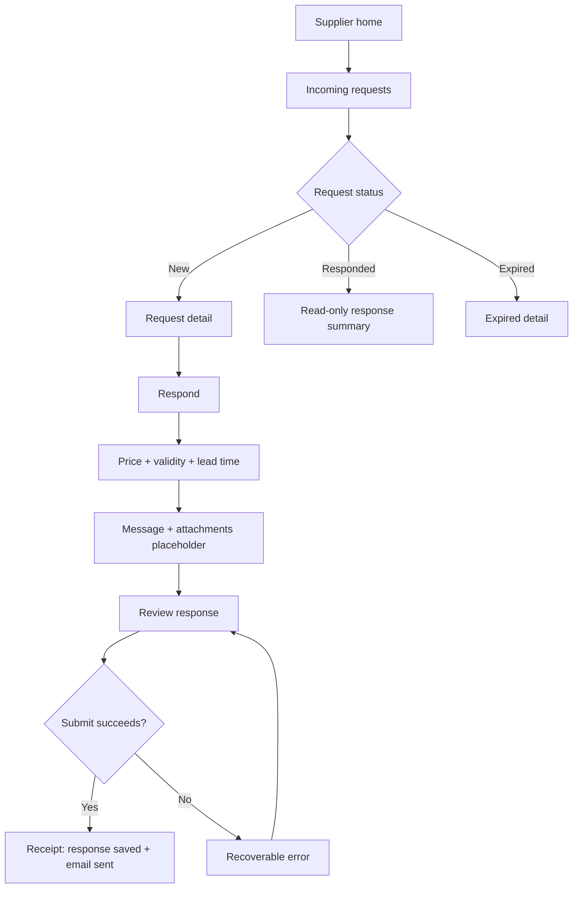
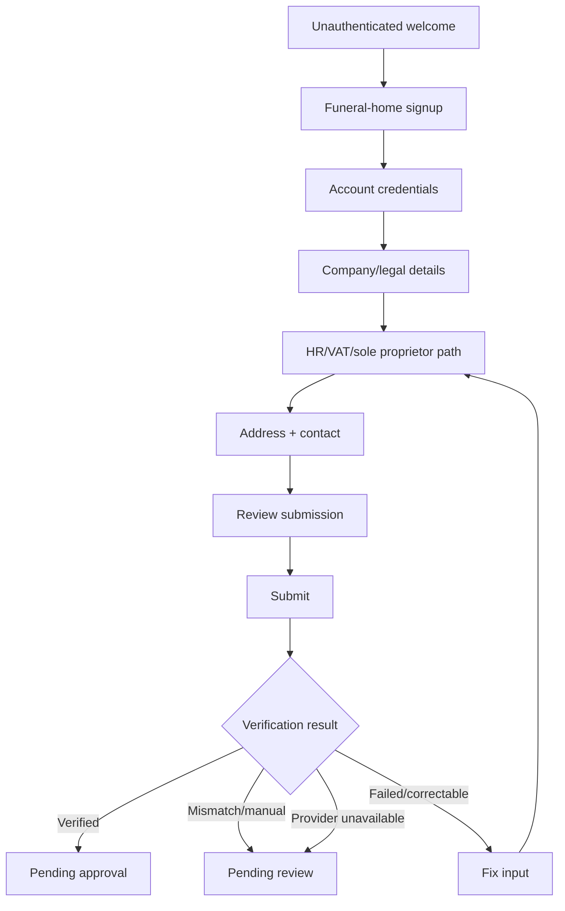

# UX Design Specification Bestattungszentrum

**Author:** Fariskunic
**Date:** 2026-05-23

---

<!-- UX design content will be appended sequentially through collaborative workflow steps -->

## Executive Summary

### Project Vision

Bestattungszentrum Mobile is a trust-first mobile workspace for Germany-based funeral homes and suppliers. It helps funeral homes discover verified supplier partners and send structured quote requests without turning the product into ecommerce, chat, or a public consumer marketplace. For suppliers, it provides a focused inbox and response flow that turns inbound RFQs into clear, email-backed commercial replies.

The UX must preserve the platform's operating model: the app captures structured intent, status, and history, while substantive commercial conversation remains email-backed. The product should feel serious, calm, and operationally useful rather than promotional or consumer-shopping oriented.

### Target Users

Funeral-home staff use the app under time pressure while coordinating sensitive services. They need quick supplier discovery, clear verification/account status, low-friction RFQ creation, and confidence that requests were sent properly.

Supplier staff use the app to review incoming requests, inspect structured requirements, and submit quote responses with price, validity, lead time, message, and attachments when supported. Their experience should emphasize clarity, response readiness, and avoiding duplicate or incomplete replies.

Platform admins are not primary mobile users. Admin capabilities belong in the Next.js back office, with the mobile app limited to internal seeded-user testing where needed.

### Key Design Challenges

- Preserve trust and restraint in a sensitive industry while still making procurement efficient.
- Support two distinct role experiences in one app without confusing navigation or exposing wrong-role flows.
- Make dynamic category-specific quote forms understandable on small screens without hard-coding category UX.
- Communicate account, verification, email dispatch, quote, and suspension states with precise German-first copy, with English supported as the secondary product language.
- Align mobile UX with backend realities that are still settling, especially auth/session behavior, supplier search params, quote response decisions, attachments, and signup endpoint naming.

### Design Opportunities

- Turn structured RFQs into the product's core advantage by making request creation feel guided, complete, and faster than back-and-forth email.
- Use calm operational UI patterns: searchable supplier lists, status-led cards, review-before-send flows, explicit empty/error states, and clear next-step messaging.
- Build a distinctive but restrained brand experience using `#B8312F`, warm white surfaces, Cormorant Garamond for selected brand moments, and highly legible sans typography for dense mobile workflows.
- Make the role gate and home screens immediately reassure users that they are in the right workspace with the right permissions.

## Core User Experience

### Defining Experience

The defining experience is a guided RFQ loop: a funeral-home user identifies a supplier, creates a structured request, reviews it, sends it, and can immediately see what happened next. The mobile app should make this feel like a professional procurement workflow, not a shopping cart or chat thread.

For suppliers, the defining experience is a focused request inbox: open the RFQ, understand the need, respond with price, validity, lead time, message, and attachments when available. The supplier should never wonder whether a request has already been answered or what information is required.

### Platform Strategy

Bestattungszentrum is a mobile-first Expo app for iOS and Android, using touch-first navigation, large tap targets, and list/detail/form patterns. It should preserve Expo Router route grouping around unauthenticated, funeral-home, supplier, and shared flows.

The product should support offline-tolerant reading where feasible, especially previously loaded requests and profile/status information, but writes should require connectivity. Deep links from email should open the relevant request or response detail after auth and role checks.

### Effortless Interactions

- Signing in and landing in the correct role workspace.
- Understanding account status: active, pending approval, pending review, suspended, or verification failed.
- Searching suppliers by category, region, language, certification, and text.
- Starting an RFQ from a supplier card or supplier detail screen.
- Completing category-specific RFQ fields without understanding the underlying schema.
- Reviewing before send and seeing clear confirmation that email notification happened.
- Opening supplier RFQs and submitting a response without duplicate or ambiguous states.

### Critical Success Moments

- First login: the user immediately sees the correct funeral-home or supplier experience.
- Funeral-home discovery: the user finds a credible supplier quickly enough to trust the directory.
- RFQ review: the user feels the request is complete before sending.
- Send confirmation: the app clearly explains that the supplier was notified by email and what happens next.
- Supplier response: the supplier can understand and answer the request from one screen flow.
- Suspended or pending states: the app explains restrictions without creating panic or shame.

### Experience Principles

- Structured, not transactional: every RFQ flow should reinforce that this is a request marketplace, not ecommerce.
- Calm under time pressure: screens should reduce ambiguity with clear status, plain German-first copy, and predictable next actions.
- Multilingual by design: every user-facing label, message, status, and validation string must be externalized for German first and English second.
- Role clarity first: navigation, tabs, and CTAs must always match the current user role and tenant state.
- Review before consequence: important actions such as signup submission, RFQ send, and quote response submission should include review or confirmation.
- Dynamic but controlled: category-specific fields should be rendered from schemas, but the UI should normalize them into familiar mobile form controls.
- Email-aware transparency: users should know when the app records an event, when email is sent, and when follow-up moves outside the app.

## Desired Emotional Response

### Primary Emotional Goals

The primary emotional goal is calm confidence. Users should feel that the app is serious, trustworthy, and clear enough to use during sensitive, time-pressured work.

Funeral-home users should feel in control when searching suppliers and sending RFQs. They should trust that the request is complete, sent to the right recipient, and recorded for later reference.

Supplier users should feel oriented and prepared. Incoming requests should feel actionable, not vague or burdensome, and the response flow should make it clear what is required before submitting.

### Emotional Journey Mapping

First launch and login should feel grounded and professional. The user should immediately understand whether they are signing in, applying as a funeral home, or waiting on account approval.

During supplier discovery, the desired feeling is focus. Search, filters, and supplier cards should reduce the cognitive burden of finding a credible supplier quickly.

During RFQ creation, the desired feeling is guided completeness. The form should make users feel that important details are being captured without forcing them to understand backend schemas or category taxonomy.

After sending an RFQ or quote response, the desired feeling is relief. The app should clearly confirm what was saved, what email notification was sent, and what happens next.

When something goes wrong, the desired feeling is recoverability. Errors, offline states, validation failures, pending review, and suspension states should be explicit without sounding accusatory or alarming.

### Micro-Emotions

- Confidence over uncertainty when role, account status, and permissions are shown.
- Trust over skepticism when supplier verification, category fit, and contact transparency are visible.
- Focus over overwhelm in supplier lists, filters, and forms.
- Relief over anxiety after RFQ send and quote response submission.
- Respect over shame in blocked states such as suspended accounts, pending review, or failed verification.
- Preparedness over ambiguity for supplier users reviewing an incoming RFQ.

### Design Implications

- Use status-led UI throughout: clear labels, restrained badges, timestamps, and next-action copy.
- Avoid ecommerce signals such as carts, checkout, buying language, celebratory success screens, and urgency pressure.
- Use German-first, direct, composed copy with no exclamation-heavy tone.
- Use red primarily for brand, primary actions, and active navigation, not as a constant alert color.
- Make errors instructional and calm: what happened, whether data was saved, and what the user can do next.
- Treat confirmation screens as operational receipts rather than celebrations.

### Emotional Design Principles

- Confidence is the product feeling: every flow should make the user more certain about status, recipient, and next step.
- Serious does not mean cold: use warm surfaces, generous spacing, and clear language without ornamental softness.
- Blocked states must preserve dignity: pending, suspended, failed, and unavailable states should be precise and non-judgmental.
- Relief comes from closure: every submitted RFQ or response needs a clear result, timestamp, and expectation-setting message.
- Trust is built through evidence: show verification, category match, history, and dispatch status where relevant.

## UX Pattern Analysis & Inspiration

### Inspiring Products Analysis

The strongest documented inspiration source is Otto-like mobile commerce structure: bold red brand presence, white surfaces, large touch targets, modular content blocks, direct navigation, and high scanability. Bestattungszentrum should borrow the operational clarity and mobile-first rhythm without copying retail shopping patterns.

The second inspiration category is professional inbox/workflow software: status-led lists, detail views, filtered queues, and clear completion states. This is most relevant for supplier RFQ review and funeral-home request history.

The third inspiration category is guided mobile form flows: multi-step forms with clear progress, saved state, review-before-submit, inline validation, and confirmation receipts. This is most relevant for funeral-home signup, RFQ creation, and quote response submission.

### Transferable UX Patterns

- Bottom tab navigation for stable role workspaces.
- Search plus horizontal filter chips for fast supplier discovery.
- Status badges and timestamp metadata for requests, responses, account states, and dispatch states.
- List-to-detail patterns for supplier cards, RFQ history, and supplier inboxes.
- Multi-step forms for signup, RFQ creation, and quote response submission.
- Review screens before irreversible or business-relevant submissions.
- Confirmation screens that explain next steps rather than celebrate.
- Deep-link routing from email into the relevant request or response detail after auth.

### Anti-Patterns to Avoid

- Shopping-cart, checkout, order, or payment language.
- Real-time chat metaphors that imply the app hosts the whole conversation.
- Playful illustrations, confetti, or overly casual empty states.
- Dense admin-style tables in the mobile app.
- Red used as a constant warning/background color instead of a brand and action color.
- Hidden role restrictions where the user only discovers a blocked action after filling a form.
- Dynamic quote forms that expose raw schema concepts to users.
- Success states that fail to say whether an email was sent or what happens next.

### Design Inspiration Strategy

Adopt Otto-like mobile clarity: strong brand red, clear hierarchy, large touch targets, white/warm surfaces, and quick scanning.

Adapt professional workflow patterns for RFQ and supplier inbox states: queues, statuses, deadlines, timestamps, and clear next actions.

Adapt guided-form patterns for sensitive, high-consequence flows: signup, RFQ creation, and supplier quote response.

Avoid ecommerce and consumer-social conventions. Bestattungszentrum should feel like a composed B2B operating tool with a distinctive brand, not a retail marketplace or messaging app.

## Design Direction Decision

### Primary Direction

The implementation reference direction is **Quiet OTTO Native**.

This direction is based on the live OTTO app screenshots rather than the louder App Store marketing previews. It keeps the useful mobile mechanics: light gray canvas, large rounded search pill, white rounded modules, modular category tiles, horizontal card rhythm, bold direct headings, red active tab state, and stable bottom navigation.

It is intentionally quieter than OTTO because Bestattungszentrum serves sensitive funeral-industry work. The app must not borrow coupon pressure, retail urgency, product-shopping dominance, cart/order language, or the loud floating assistant treatment.

### Supporting Pattern Libraries

Use these supporting directions only for their specific patterns:

- **Guided Anfrage** for signup, RFQ creation, quote response forms, multi-step progression, review-before-submit, and confirmation receipts.
- **Quiet Ledger** for request history, supplier inbox, timelines, email dispatch traces, and audit/status lists.
- **Warm Institutional** for splash, pending approval, pending review, verification, suspended-account, and other brand/status moments where dignity and gravity matter.

### Archived Explorations

The earlier directions are archive-only and should not be used as implementation references:

- Operational Red informed the active/action red system, but is too app-bar-heavy for the final shell.
- Supplier Command informed inbox density, but the dark chrome is too strong for the baseline supplier experience.
- Blue Dispatch Accent remains only as a semantic info/dispatch color idea, not a screen direction.
- Restrained OTTO Framework was superseded by Quiet OTTO Native after the live app screenshots.

### Implementation Guidance

Build the app from one primary shell and three supporting pattern libraries. When there is a conflict, **Quiet OTTO Native wins for shell/discovery/layout**, **Guided Anfrage wins for forms**, **Quiet Ledger wins for history/timeline**, and **Warm Institutional wins for account-state moments**.

The HTML showcase is now an implementation reference, not an equal-weight direction library.

## User Journey Flows

### Role-Gated App Entry

Users enter through login or signup. After authentication, the app resolves session, account status, role, tenant, and language, then routes to the correct workspace.

### Funeral Home: Discover Supplier And Send RFQ

The core journey starts with search/category discovery, moves into supplier detail, then uses a Guided Anfrage flow with review-before-send and a professional receipt.

### Supplier: Review RFQ And Submit Response

The supplier journey is an inbox workflow: triage, inspect structured details, respond, review, and confirm email-backed dispatch.

### Funeral Home Signup And Verification

Signup must handle German-first company registration while supporting manual review paths for sole proprietors and verification failures.

### Journey Patterns

- Top search is the main discovery entry point.
- Bottom tabs provide stable role navigation.
- Important actions use review-before-submit.
- Submitted business actions end in a receipt, not a celebration.
- Account and request states use explicit status screens/cards.
- German is the default language; English mirrors the same structure.

### Flow Optimization Principles

- Keep the first screen after login role-specific.
- Avoid hidden restrictions: show pending/suspended states before users fill forms.
- Preserve entered form data across validation failures.
- Map backend enum/status values to localized display labels.
- Make next steps explicit after every RFQ or quote-response submission.

## Design System Foundation

### 1.1 Design System Choice

Bestattungszentrum Mobile should use the existing Ignite/Expo component foundation as its design system base, with a project-specific brand theme and a small set of domain-specific composed components.

This is a custom-branded extension of the current app foundation rather than a new third-party design system. The existing Ignite components should remain first-class: `Screen`, `Text`, `Button`, `TextField`, `Card`, `ListItem`, `Header`, `Icon`, `EmptyState`, toggles, and existing theme primitives.

### Rationale for Selection

The current app is already built on Ignite with Expo Router, React Native, theme context, i18n, MMKV, apisauce, Jest, Maestro, and dependency-cruiser. Replacing that foundation would slow delivery and add unnecessary migration risk before the product has validated its first vertical slices.

A custom-branded Ignite extension gives the right balance: fast implementation, native mobile fit, controlled visual identity, and enough flexibility for the operational B2B workflows Bestattungszentrum needs.

The brand requirements are distinctive but not exotic. They can be handled through tokens, typography, spacing, component variants, and composed domain components rather than a full custom UI framework.

### Implementation Approach

Keep Ignite components as the atomic layer and define Bestattungszentrum-specific variants through theme tokens and wrapper/composed components where needed.

Core implementation layers:

- Theme tokens: color, typography, spacing, radii, borders, shadows/elevation, status colors.
- Base component variants: primary/secondary/destructive buttons, dense and regular cards, text field states, status badges, list rows, headers, tabs.
- Domain components: supplier card, RFQ card, request status badge, category chip, verification status panel, quote timeline item, review summary block, empty/error state templates.
- Screen patterns: role home, searchable list, list-detail, multi-step form, review-before-submit, confirmation receipt.

Avoid creating a parallel component system. Any new component should compose existing primitives and earn its place by repeated use across role flows.

### Customization Strategy

Brand customization should center on `#B8312F` as the canonical primary red, with `#C8102E` as a stronger accent/pressed state and warm off-white backgrounds. Red should be used for primary actions, active navigation, selected states, and brand moments, not as a general alert surface.

Typography should replace the current Space Grotesk default. Use Cormorant Garamond for brand/display moments only, and a highly legible sans family such as Inter or Noto Sans for product UI, lists, labels, forms, tabs, and long German copy.

Component styling should be restrained: white or warm-white surfaces, thin borders, minimal elevation, clear status metadata, 48dp minimum touch targets, and no playful illustration system unless a later brand decision explicitly calls for one.

The design system should include German text-length QA as a first-class constraint. Buttons, tabs, cards, empty states, and form labels must be checked against long German labels on small phones.

## 2. Core User Experience

### 2.1 Defining Experience

The defining experience is guided RFQ creation with a professional receipt.

A funeral-home user starts from a need, finds a relevant supplier, creates a structured request, reviews the details, sends it, and receives a clear confirmation that the request was recorded and the supplier was notified by email.

For suppliers, the companion defining experience is response readiness: open a request, understand the structured need, submit a quote response, and receive confirmation that the funeral home was notified.

### 2.2 User Mental Model

Funeral-home staff currently think in terms of trusted supplier relationships, phone calls, email requests, urgency, availability, and practical details. They are not thinking in ecommerce terms. They expect to ask for an offer, not place an order.

Supplier staff think in terms of inbound requests, enough detail to price or confirm availability, response deadlines, and avoiding duplicate work. They expect a request inbox and a response form, not a conversation feed.

The app should map to these mental models: directory, request, response, status, receipt, history. It should avoid mental models like cart, checkout, order tracking, chat, or social messaging.

### 2.3 Success Criteria

The core experience succeeds when:

- A funeral-home user can find a supplier and start an RFQ without searching for the right action.
- The RFQ form captures universal and category-specific details without exposing raw schema complexity.
- The user can review before send and understand exactly who receives the request.
- The confirmation state explains what was saved, what email was sent, and what happens next.
- The outgoing request appears in history with status, timestamp, supplier, category, and timeline access.
- A supplier can open an incoming request and understand whether they can respond immediately.
- A supplier can submit a quote response without ambiguity around price, validity, lead time, message, and attachments.

### 2.4 Novel UX Patterns

The product should use established mobile patterns rather than novel gestures or interaction models. The innovation is not in a new control; it is in combining trusted supplier discovery, schema-driven request capture, email-backed dispatch, and status history into one calm mobile workflow.

Established patterns to use:

- Search and filters for discovery.
- Cards and list-detail navigation for suppliers and RFQs.
- Multi-step forms for signup and RFQ creation.
- Review-before-submit for important business actions.
- Status badges and timeline rows for request history.
- Confirmation receipts after submissions.

The unique twist is the dynamic RFQ form. Category-specific schema fields should render as familiar mobile controls: text fields, selects, segmented controls, date pickers, toggles, checkboxes, file placeholders, and validation messages.

### 2.5 Experience Mechanics

**Initiation:** The user begins from a supplier card, supplier detail CTA, category entry point, or recent supplier shortcut. CTAs should use request language such as `Angebot anfragen` or `Anfrage senden`, never checkout language.

**Interaction:** The user moves through a guided form: request basics, category-specific details, deadline/attachments placeholder, and review. Progress should be visible, data should be preserved between steps, and validation should happen close to the relevant field.

**Feedback:** The app shows inline validation, saved/draft indicators where appropriate, disabled submit states with clear reasons, and calm error messages for backend or connectivity failures.

**Completion:** The user sees an operational receipt: request id/reference, supplier name, timestamp, email dispatch status when available, and next step expectations. From there the user can view the request detail, open request history, or return to discovery.

**Supplier companion flow:** The supplier opens an incoming request, reviews the structured fields and timeline, taps respond, fills response fields, reviews, submits, and sees a confirmation that the funeral home was notified.

## Visual Design Foundation

### Color System

The canonical primary brand color is `#B8312F`. It should be used for primary actions, active navigation, selected filter states, key brand surfaces, and occasional reversed brand moments.

Recommended semantic mapping:

- `color.primary`: `#B8312F`
- `color.primaryPressed`: `#8E2422`
- `color.primaryAccent`: `#C8102E`
- `color.background`: `#F6F3F1` or `#F7F7F7`
- `color.surface`: `#FFFFFF`
- `color.surfaceWarm`: `#F5F1EC`
- `color.ink`: `#1A1614`
- `color.text`: near-black, not pure black
- `color.textMuted`: neutral gray for metadata and helper text
- `color.border`: warm light gray, close to `#D8D1C5`
- `color.success`: distinct green for verified, sent, and completed states
- `color.warning`: amber for pending, review, and attention states
- `color.danger`: red separate from brand red for destructive or failed states

Brand red should not be the default color for all status states. Pending, failed, suspended, verified, sent, and responded states need distinguishable semantic treatment so the brand color does not become confused with errors.

### Typography System

Use two typography modes:

- Brand/display: Cormorant Garamond, limited to splash, selected onboarding headings, empty states with brand presence, and occasional major screen titles.
- Product UI: Inter or Noto Sans for all dense interface work, including tabs, lists, supplier cards, forms, labels, buttons, badges, validation text, and long German copy.

The current Space Grotesk default should be replaced during theme work rather than mixed with the new brand system.

Typography should favor readability over drama:

- Body: 16px equivalent with comfortable line height.
- Metadata and helper text: 12-14px equivalent, never below accessibility-safe minimums.
- Screen titles: compact enough for mobile operational views.
- Buttons and tabs: designed against long German strings.
- Letter spacing: normal for product text; avoid wide tracking except in rare brand lockup contexts.

### Localization & Language Requirements

The mobile app must be multilingual from the first implementation pass. German is the primary/default language and English is the secondary supported language.

All user-facing strings must be externalized through the app's i18n layer, including navigation labels, buttons, form labels, helper text, validation errors, empty states, account-status copy, RFQ statuses, quote-response statuses, email-dispatch explanations, legal links, and accessibility labels.

German copy is canonical for UX layout validation. English copy should preserve the same meaning and operational tone, but the UI should be measured against German first because German labels and compound nouns are more likely to stress mobile layouts.

Implementation requirements:

- Default locale: German (`de`).
- Secondary locale: English (`en`).
- No hard-coded visible strings in screens or reusable components.
- Language switcher available in settings and honored after restart.
- Backend-provided enum/status values must be mapped to localized display strings in the mobile app.
- Screens must be QA-tested in both German and English on small and large phones.
- Date, number, currency, and plural formatting must use locale-aware formatters.

### Spacing & Layout Foundation

Use an 8px spacing rhythm with 4px available for fine adjustments. Mobile screens should feel generous enough for sensitive work but not decorative or sparse.

Layout principles:

- 16px horizontal screen padding as the default mobile baseline.
- 20-24px section spacing between major groups.
- 8-12px spacing inside dense rows and cards.
- 48dp minimum touch targets for all actionable controls.
- Stable dimensions for chips, tabs, icon buttons, status badges, and form controls to avoid layout shifts.
- Prefer full-width screen sections and focused cards for individual repeated items; avoid nested cards.

Supplier lists, RFQ history, and supplier inbox screens should prioritize scanning: title, status, category, date/deadline, and one clear next action.

### Accessibility Considerations

All color pairings must meet WCAG AA contrast. Red-on-white and white-on-red combinations need explicit verification before implementation.

German-first copy requires overflow testing on small phones. Long labels should wrap intentionally or use shorter approved German product language, not shrink unpredictably.

The app should support Dynamic Type where practical, VoiceOver/TalkBack labels, visible focus/pressed states, and clear error associations for form fields.

Status should never rely on color alone. Use label text, icons where helpful, and consistent placement.

## Component Strategy

### Design System Components

Use the existing Ignite/Expo primitives as the foundation:

- `Screen` for safe-area-aware screen structure.
- `Text` for localized typography variants.
- `Button` for primary, secondary, destructive, and ghost actions.
- `TextField` for standard form input.
- `Card` for repeated supplier, RFQ, status, and review modules.
- `ListItem` for compact rows in inbox/history/settings.
- `Header` for route-level titles and back actions.
- `Icon` for tab, status, and action affordances.
- `EmptyState` for no-results, no-requests, and unavailable states.
- Toggle primitives for schema-driven boolean or option fields.

### Custom Components

#### App Search Header

Purpose: provide OTTO-like search-first navigation without retail energy.
Usage: home, search/discovery, supplier directory.
Anatomy: back affordance when needed, rounded search pill, optional notification/status icon.
States: default, focused, loading, disabled, no-query.
Accessibility: localized search label and clear button label.

#### Category Tile

Purpose: scannable category entry point for supplier discovery and RFQ start.
Usage: home, search tab, RFQ category selection.
Anatomy: localized category name, optional icon/initial/visual, active/selected state.
States: default, selected, disabled, loading.
Content: German canonical category label with English equivalent.

#### Supplier Card

Purpose: summarize a verified supplier and expose the request CTA.
Usage: discovery lists, featured suppliers, supplier search results.
Anatomy: supplier mark/logo, name, location/regions, category badges, verification badge, language indicators, CTA.
States: active, deactivated, unavailable, loading, empty image fallback.
Interaction: opens supplier detail; CTA starts RFQ.

#### RFQ Card

Purpose: summarize outgoing or incoming requests.
Usage: funeral-home request history, supplier inbox, home summaries.
Anatomy: subject, supplier/funeral-home name, category, status badge, deadline/timestamp, response/email metadata.
Variants: outgoing, incoming, compact, detailed.
States: sent, responded, expired, cancelled, pending email, email failed.

#### Status Badge

Purpose: localized, color-and-label state display.
Usage: account states, RFQ states, quote response states, verification, email dispatch.
States: success, warning, danger, info, neutral.
Accessibility: status must not rely on color alone.

#### Guided Form Stepper

Purpose: support signup, RFQ creation, and quote response flows.
Usage: multi-step forms with review-before-submit.
Anatomy: step indicator, title, helper text, content area, back/next actions, save/progress state.
States: current, complete, invalid, blocked, submitting.

#### Dynamic Schema Field

Purpose: render category-specific `quoteFormSchema` fields as familiar mobile controls.
Supported controls: text, number, date, select, multi-select, boolean, segmented option, attachment placeholder.
States: default, focused, invalid, disabled, unsupported field type.
Fallback: unsupported fields show a controlled message and do not crash the form.

#### Review Summary Block

Purpose: show business-critical submission details before sending.
Usage: signup review, RFQ review, quote response review.
Anatomy: grouped label/value rows, recipient, language/status metadata, edit links.
Interaction: edit section, submit.

#### Submission Receipt

Purpose: close business actions with operational certainty.
Usage: RFQ sent, response sent, signup submitted.
Anatomy: success/status label, timestamp, reference id, email-dispatch explanation, next actions.
Tone: receipt, not celebration.

#### Account Status Panel

Purpose: explain pending approval, pending review, suspended, verification failed, or provider unavailable states.
Usage: post-login gate, signup result, profile/account screens.
Anatomy: status label, explanation, restrictions, next step, contact action where appropriate.
Tone: precise and non-judgmental.

#### Timeline Item

Purpose: show request lifecycle and email-dispatch events.
Usage: RFQ detail, supplier request detail, quote response history.
Anatomy: event label, timestamp, actor/system source, optional details.
States: completed, pending, failed, informational.

### Component Implementation Strategy

Build custom components by composing Ignite primitives and theme tokens. New components should live close to repeated domain use cases and avoid creating a parallel UI kit.

Component text must always come from i18n keys. Components should accept display-ready localized labels or well-defined enum values mapped through localization helpers.

Every component with status meaning must expose text and accessibility labels, not just color.

### Implementation Roadmap

Phase 1: shell and session foundation

- App Search Header
- Status Badge
- Account Status Panel
- Submission Receipt
- role-aware tab/header variants

Phase 2: funeral-home discovery and RFQ

- Category Tile
- Supplier Card
- Guided Form Stepper
- Dynamic Schema Field
- Review Summary Block
- RFQ Card

Phase 3: supplier inbox and response

- RFQ Card incoming variant
- Timeline Item
- quote response review/receipt variants

Phase 4: signup and polish

- signup-specific stepper sections
- verification status panel variants
- empty/error state templates
- multilingual overflow QA variants

## UX Consistency Patterns

### Button Hierarchy

Primary actions are reserved for irreversible or business-critical progress: send RFQ, submit quote response, complete signup, save account changes. Use one primary button per decision area, styled with brand red.

Secondary actions support review and navigation: back, edit, save draft, view details, change supplier, change category. Use neutral or outlined styling.

Destructive actions use a separate danger treatment and confirmation where data or business state would be changed.

All button labels must come from i18n. German labels are the layout baseline. Buttons must support loading, disabled, pressed, and error-recovery states without changing layout height.

### Feedback Patterns

Success feedback should feel like an operational receipt, not celebration. Show what happened, when it happened, and what the next step is.

Errors should be specific and recoverable. Prefer inline validation for form fields, screen-level banners for system/API failures, and receipt-level warnings for email dispatch issues.

Warnings are used for pending approval, missing required details, expiring quotes, unsupported category schema fields, or email delivery uncertainty.

Status must always include a localized text label. Color alone is never enough.

### Form Patterns

Long forms use guided steps with review-before-submit. Signup, RFQ creation, and quote response flows should avoid single-screen form walls.

Validate required fields at step transitions and on submit. Field-level validation messages should appear close to the field and remain visible until resolved.

Dynamic schema fields should map to familiar mobile controls: text input, number input, date picker, select, multi-select, segmented options, boolean toggle, or attachment placeholder.

Unsupported schema fields should fail gracefully with a controlled localized message rather than blocking or crashing the flow.

### Navigation Patterns

Navigation is role-aware. Funeral homes should see discovery, RFQs/history, and account flows. Suppliers should see inbox, responses/history, and account flows.

Use the quiet OTTO-inspired top search header for discovery-heavy screens, with back affordance where needed and optional status/notification affordance only when meaningful.

Bottom tabs should remain stable, localized, and visually restrained. Active state uses brand red; inactive state uses neutral gray.

Wrong-role or unavailable routes should show an account/status panel instead of a broken or empty screen.

### Search and Filtering Patterns

Search begins with a large rounded search field. Category entry should use scannable tiles, not dense dropdown-first navigation.

Filters should be visible, reversible, and localized. Selected filters use a clear active state and can be cleared individually or as a group.

Search empty states should suggest the next useful action: clear filters, browse categories, or adjust location/category criteria.

### Loading, Empty, and Error States

Use skeletons or stable placeholders for supplier lists, RFQ cards, and inbox rows. Avoid spinners as the only loading feedback on content-heavy screens.

Empty states should be calm and practical: no RFQs yet, no supplier responses yet, no matching suppliers, no inbox items.

Error states must include retry where retry is meaningful. Authentication, approval, suspension, and verification failures should route through account status panels.

### Modal and Overlay Patterns

Use modals sparingly for focused decisions: confirm cancel, discard changes, leave unsent response, or explain status details.

Bottom sheets can be used for filter selection, language selection, and compact option sets.

Avoid promotional overlays, coupon-style interruptions, or retail urgency patterns.

### Accessibility and Localization Rules

All patterns must support German first and English second. German copy is canonical for overflow testing.

Every actionable control needs a localized accessibility label. Status badges, icon buttons, search clear buttons, and tabs require explicit labels.

Touch targets must be at least 48dp. Text must support larger accessibility sizes where practical without hiding critical actions.

## Responsive Design & Accessibility

### Responsive Strategy

The mobile app is phone-first. Core layouts must work on small and large phones before tablet-specific refinements are considered.

Small phones should prioritize one primary task per screen: discover supplier, review RFQ, respond to request, complete signup, or check account status. Dense data should collapse into cards and rows with clear status, date, category, and next action.

Large phones can use more generous spacing, larger content previews, and wider cards, but should not introduce different navigation models.

Tablet support is secondary and should use the extra width for readability and scan speed: wider cards, two-column category grids, improved form review layouts, and more visible supporting metadata. Tablets should remain touch-first.

Desktop is not a target for the mobile app. Admin and platform management remain in the Next.js back office.

### Breakpoint Strategy

Use mobile-first responsive behavior based on available width, not device assumptions.

Recommended layout bands:

- Compact phone: 320-374px
- Standard phone: 375-430px
- Large phone: 431-767px
- Tablet: 768px+

Compact phones are the stress case for German-first labels, bottom tabs, form fields, status badges, and primary action buttons.

German copy is the canonical breakpoint test language. English must also be tested, but German should drive minimum layout resilience.

Layouts should avoid viewport-scaled typography. Use stable tokenized type sizes, wrapping, and component constraints instead.

### Accessibility Strategy

Target WCAG AA-equivalent accessibility for mobile, with native iOS and Android accessibility support.

Core requirements:

- All normal text and controls meet contrast requirements.
- Brand red on white and white on brand red must be explicitly verified.
- Status is communicated with localized text, not color alone.
- All icon-only controls have localized accessibility labels.
- Touch targets are at least 48dp.
- Inputs expose labels, errors, required state, and helper text to assistive technologies.
- Dynamic Type/font scaling should be supported where practical without hiding critical actions.
- Screen reader order follows the visual task order.
- Focus and loading states must be announced for business-critical actions.

Sensitive workflows should avoid alarming language. Error and status copy must be precise, calm, and actionable.

### Testing Strategy

Responsive testing must cover:

- Small iPhone-sized viewport
- Standard iPhone-sized viewport
- Large Android-sized viewport
- Tablet-sized viewport where supported
- German and English language modes
- Long German category, status, and button labels
- Empty, loading, error, and disabled states

Accessibility testing must cover:

- VoiceOver on iOS
- TalkBack on Android
- Large text settings
- Reduced motion settings
- Color contrast checks
- Touch target checks
- Form validation with screen reader enabled
- Status badge comprehension without relying on color

Critical flows to test:

- Signup submission
- Pending approval/account gate
- Supplier discovery and search
- RFQ creation
- RFQ sent receipt
- Supplier inbox
- Quote response submission
- Email dispatch warning/failure states

### Implementation Guidelines

Use React Native layout primitives with flexible widths, wrapping text, and stable component dimensions. Avoid fixed heights for text-heavy components unless content is explicitly constrained.

Build every reusable component with localization and accessibility props from the start. Components should either receive localized display strings or map known enum values through localization helpers.

Use semantic accessibility roles where appropriate for buttons, tabs, search inputs, alerts, headers, and status content.

Primary actions should remain reachable without overlapping bottom navigation, keyboard, or safe areas.

Forms should handle keyboard avoidance, scroll-to-error behavior, and review-before-submit patterns.

Animations and transitions should be subtle and respect reduced motion settings.

No visible user-facing string should be hard-coded in screens or components. German and English translations are part of the implementation definition of done.
